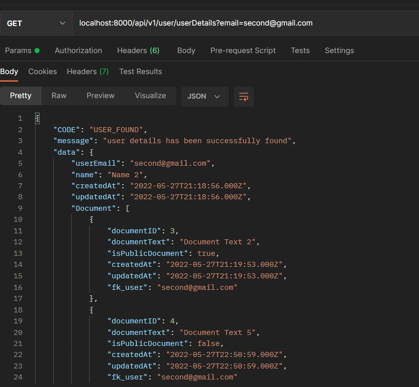
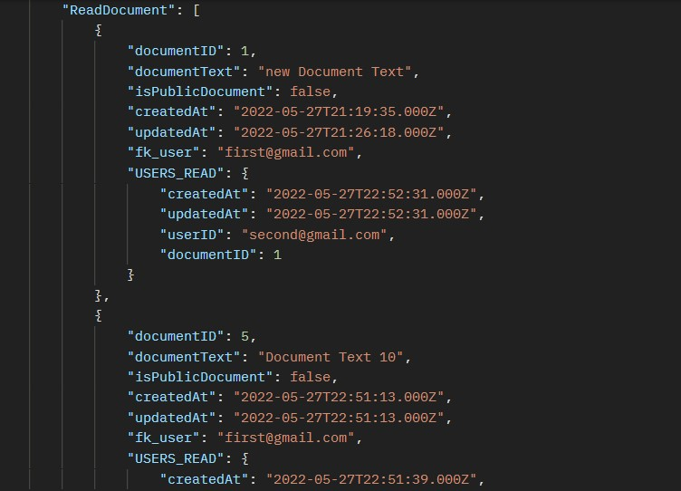
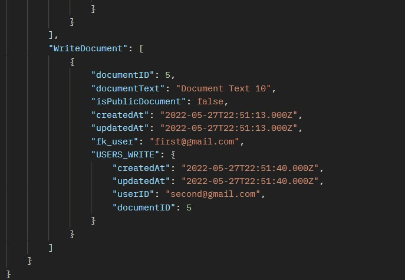
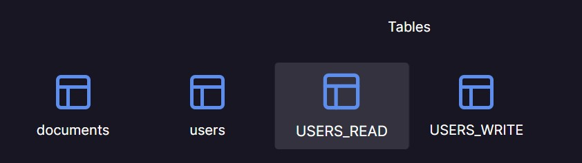
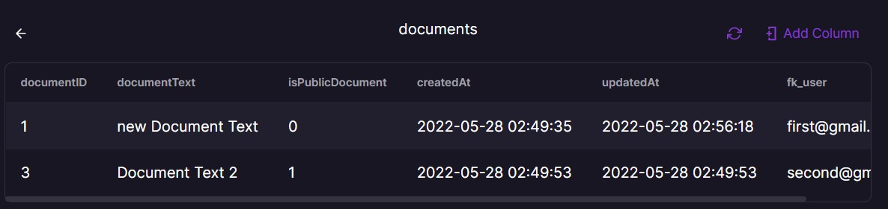
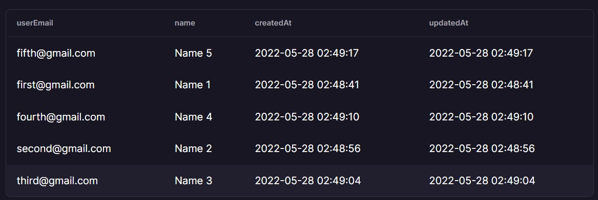
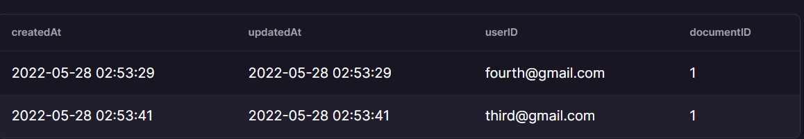
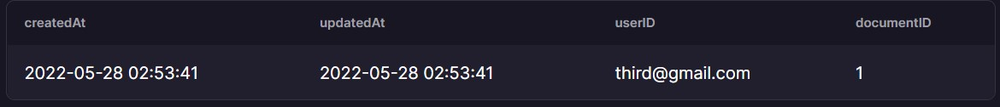

# Chronicle [Take Home Project]

### About :
- Task of this application was to create a small scale document sharing platform which contains a user who can have four different roles :
  - Owner Of the document 
  - Read the document [decided by owner]
  - Edit and Share the document [decided by owner]
  - Does not have any permission at all [As the Part of bonus challenge such type of user can view public documents]
  
##### Note : 
  - Working of this project can be found out at `https://drive.google.com/file/d/1BC_zTJjIU4dDyMmB937LMPrA_eahIqUf/view?usp=sharing` or can be viewed at bottom of this readme under Working heading.
  - Hosted at : ``
#### Bonus Challenge :
1) **Challenge =** Write API for getting all the documents that a user has access to, the documents that they created and the ones that are shared with them.   
   **Solution :**      
Proofs : 




3) **Challenge =** Implement publicly viewable documents. Public documents can be viewed by anyone even if they don’t have any access to the document. The access to private documents remains unchanged.  
**Solution :** Basically I included a field in document schema called `isPublicDocument` which takes in a boolean , if it's true then the document can be publicly viewed And this boolean value can be altered by the person who has created the document.   

### Schema :
- Document schema 
```
documentID : INT [Primary Key]
documentText : VARCHAR(255)
isPublicDocument : BOOLEAN
```
- User Schema
```
userEmail : VARCHAR(255) [Primary Key]
name : VARCHAR(255) 
```

### Tables [Screenshot taken after recording] -

#### All Tables


#### Document Table


#### User Table


#### User Read [table that tells us who has got read access]


#### User Write [table that tells us who has got write access]



### Endpoints : 
- User [/api/v1/user]
  - To add a user [POST] : /add
```
        {
            "userEmail":"fifth@gmail.com",
            "name":"Name 5"
        }
```
  - To View user details [GET] : /userDetails?email=?

  
- Documents [/api/v1/documents]
  - To create a document [POST] : /create
```
        {
            "text":"Document Text 2",
            "creatorEmail":"second@gmail.com",
            "isPublicDocument":false
        }
```
  - To Give Read Permission [POST] : /giveReadPermission
```
        {
            "documentID":1,
            "givingReadPermissionTo":"fourth@gmail.com"
        }
```
  - To Give Write Permission [POST] : /giveWritePermission
```
        {
            "documentID":1,
            "givingReadPermissionTo":"fourth@gmail.com"
        }
```
  - To View The Document [GET] : /viewDocument?userEmail=?&docID=?
  - To Edit The Document [POST] : /editDocument?userEmail=?&docID=?
```
    {
        "newText":"new Document Text"
    }
```
  - To Revoke Read Permission [POST] : /revokeReadPermission?creatorEmail=?
```
   {
        "documentID":1,
        "takingPermissionFrom":"second@gmail.com"
    }
```
  - To Revoke Write Permission [POST] : /revokeWritePermission?creatorEmail=?
```
   {
        "documentID":1,
        "takingPermissionFrom":"second@gmail.com"
    }
```
  - To Allow Sharing Of Document [POST] : /allowShare
```
   {
        "documentID":1,
        "givingPermissionTo":"second@gmail.com"
    }
```

  - To Delete The Document [DELETE] : /deleteDocument?userEmail=?&docID=?


### Working 

